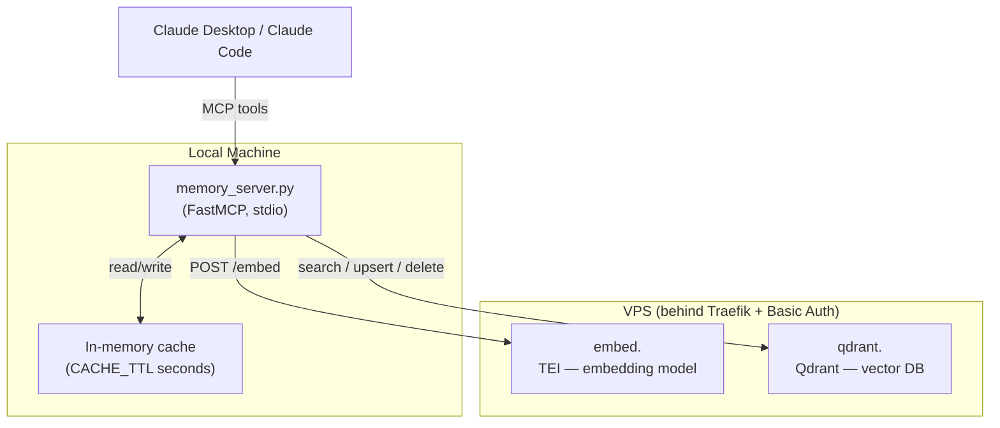
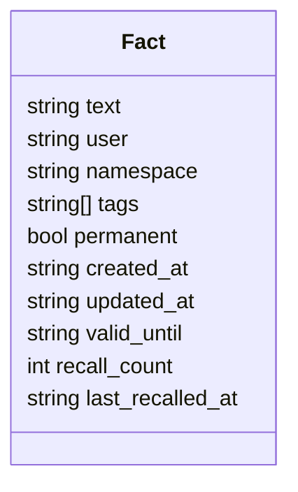
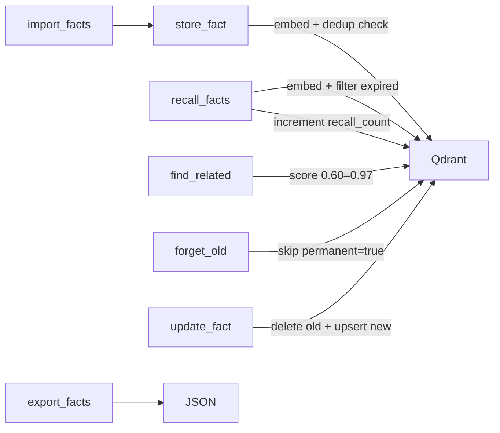

# Personal Memory Stack

Self-hosted semantic memory for Claude. Stores and retrieves facts using vector embeddings — no third-party cloud, all data stays on your VPS.

## Stack

| Component | Role |
|---|---|
| [Qdrant](https://qdrant.tech/) | Vector database |
| [Text Embeddings Inference](https://github.com/huggingface/text-embeddings-inference) | Local embedding model server |
| [intfloat/multilingual-e5-small](https://huggingface.co/intfloat/multilingual-e5-small) | Embedding model (multilingual, ~470MB) |
| [FastMCP](https://github.com/jlowin/fastmcp) | MCP server bridging Claude with the stack |
| Traefik v3 | Reverse proxy, SSL, Basic Auth |

## Architecture



Auth is handled by Traefik's Basic Auth middleware. `memory_server.py` passes credentials via `httpx.BasicAuth` — never embedded in URLs.

## Data Model

Each stored fact is a Qdrant point with the following payload:



- **namespace** — logical group (`work`, `personal`, `projects`, …)
- **permanent** — if `true`, never deleted by `forget_old()`
- **valid_until** — ISO date; expired facts are excluded from search results
- **recall_count** — incremented each time the fact is returned by `recall_facts`

## MCP Tools

### Writing

| Tool | Description |
|---|---|
| `store_fact(fact, tags?, namespace?, permanent?, valid_until?)` | Embed and save a fact. Skips near-duplicates (cosine ≥ 0.97). Warns about potentially contradicting facts (cosine 0.60–0.97). |
| `update_fact(old_query, new_fact, tags?, namespace?, permanent?)` | Semantically find a fact and replace it. Preserves metadata unless overridden. |
| `delete_fact(query, namespace?)` | Semantically find and delete the closest matching fact. |
| `forget_old(days?, namespace?, dry_run?)` | Delete facts older than N days. Skips `permanent=true`. Default: `dry_run=true`. |
| `import_facts(facts)` | Bulk import from a list of dicts (e.g. from `export_facts`). Deduplicates on import. |

### Reading

| Tool | Description |
|---|---|
| `recall_facts(query, tags?, namespace?, limit?)` | Semantic search. Returns facts with scores. Filters expired facts. Increments `recall_count`. |
| `list_facts(tags?, namespace?)` | List all facts with metadata. Shows expired count separately. |
| `find_related(query, namespace?, limit?)` | Find semantically related facts that are not direct duplicates (score 0.60–0.97). |
| `get_stats()` | Total counts, namespace breakdown, tag distribution, most recalled facts. |
| `list_tags(namespace?)` | All unique tags with usage counts. |
| `export_facts(namespace?)` | Export all facts as JSON for backup or migration. |

### Tool flow



## Prerequisites (VPS)

- Docker + Docker Compose
- Traefik v3 running with:
  - External network named `traefik`
  - `letsEncrypt` certresolver configured
  - `traefik-auth` Basic Auth middleware configured

## Server Setup (VPS)

```bash
mkdir -p /root/memory/qdrant_storage
cp .env.vps.example .env.vps
nano .env.vps
docker compose --env-file .env.vps up -d
```

`.env.vps` variables:

| Variable | Description |
|---|---|
| `MEMORY_DOMAIN` | Your domain, e.g. `example.com` — services at `embed.<domain>` and `qdrant.<domain>` |
| `EMBED_MODEL` | HuggingFace model ID, default `intfloat/multilingual-e5-small` |

Track TEI model download on first start:
```bash
docker logs -f memory-embeddings
# Ready when you see: Ready
```

Verify Qdrant:
```bash
curl https://qdrant.<your-domain>/healthz
# → {"title":"qdrant - Ready"}
```

## Local Setup

**1. Python environment**

```bash
python3.12 -m venv venv
venv/bin/pip install -r requirements.txt
```

**2. Credentials**

```bash
cp .env.example .env
nano .env
```

`.env` variables:

| Variable | Description |
|---|---|
| `MEMORY_USER` | Basic Auth username |
| `MEMORY_PASS` | Basic Auth password |
| `MEMORY_DOMAIN` | Your domain |
| `CACHE_TTL` | Search cache TTL in seconds (default: `60`) |
| `DEDUP_THRESHOLD` | Cosine similarity threshold for deduplication (default: `0.97`) |
| `CONTRADICTION_LOW` | Lower bound for contradiction warning (default: `0.60`) |

**3. Claude Desktop config**

| OS | Example file | Config location |
|---|---|---|
| macOS | `claude_desktop_config.mac.json` | `~/Library/Application Support/Claude/claude_desktop_config.json` |
| Windows | `claude_desktop_config.windows.json` | `%APPDATA%\Claude\claude_desktop_config.json` |

Restart Claude Desktop after merging the config.

**4. Claude Code (global)**

Add to `~/.claude.json` under `mcpServers`:

```json
"personal-memory": {
  "command": "/path/to/venv/bin/python3.12",
  "args": ["/path/to/memory_server.py"]
}
```

## Collection

The Qdrant collection (`memory`) is created automatically on server startup. After the first `store_fact` call it will be visible at `https://qdrant.<your-domain>/dashboard`.
