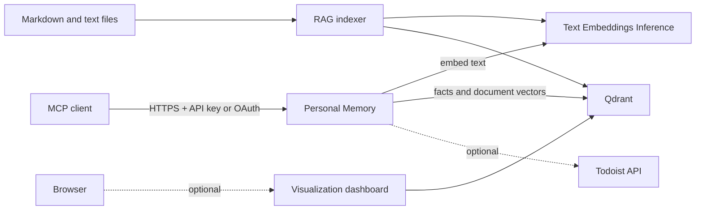

# Personal Memory

**A self-hosted memory layer that gives MCP-compatible AI clients durable, user-controlled context across sessions.**

Personal Memory stores facts as semantic memory, retrieves the context relevant to the current conversation, and can optionally search a personal document library, expose Todoist tools, and visualize what has been remembered. The service runs on infrastructure you control and presents its capabilities through Streamable HTTP MCP endpoints.

> Persistent facts are the core product. Document RAG, Todoist, OAuth onboarding, and the visualization dashboard are optional features that can be enabled independently.

## Contents

- [Why Personal Memory](#why-personal-memory)
- [What It Can Do](#what-it-can-do)
- [How It Works](#how-it-works)
- [Quick Start](#quick-start)
- [Connect an MCP Client](#connect-an-mcp-client)
- [Using Personal Memory](#using-personal-memory)
- [Core Concepts](#core-concepts)
- [Fact Lifecycle](#fact-lifecycle)
- [Tool Reference](#tool-reference)
- [Developer and Operator Guide](#developer-and-operator-guide)
- [Configuration Reference](#configuration-reference)
- [Security](#security)
- [Operations](#operations)

## Why Personal Memory

AI conversations are usually stateless. A client may know your preferences, project decisions, or working conventions during one session and lose them in the next. Repeating that context in every prompt is slow, inconsistent, and difficult to maintain.

Personal Memory provides a durable context layer between you and your AI clients:

- save explicit facts, preferences, constraints, and decisions once;
- retrieve them by meaning rather than exact wording;
- organize them without coupling memory to a single client or model;
- keep temporary information from living forever;
- inspect, export, update, or delete what has been stored;
- optionally search your own Markdown and text files through the same MCP endpoint.

The result is continuity without embedding a growing personal profile into every prompt or tying it to one AI provider.

## What It Can Do

| Capability | What it provides | Availability |
|---|---|---|
| Semantic memory | Store, recall, update, export, and safely prune durable facts | Core |
| Document search | Hierarchical semantic search across Markdown and text files | Optional: `ENABLE_RAG=true` |
| Todoist tools | Read projects and labels; read and manage tasks without exposing the token to clients | Optional: `ENABLE_TODOIST=true` |
| Visualization | Browse facts by topic, timeline, similarity graph, duplicates, and document tree | Optional: `ENABLE_VIZ=true` |
| OAuth onboarding | Authenticate compatible clients with an external or self-hosted OIDC issuer | Optional: `OAUTH_ENABLED=true` |
| Snapshots | Create and retain Qdrant snapshots on a schedule | Built in |

Facts and documents are embedded by the TEI service inside the deployment. Optional Todoist integration calls the Todoist API, and OAuth mode depends on the issuer you configure.

## How It Works



The Go server exposes two independent MCP endpoints:

- `/memory` contains semantic memory and, when enabled, document-search tools;
- `/todoist` exists only when Todoist integration is enabled.

TEI converts text into vectors. Qdrant stores those vectors and their metadata. Before opening its HTTP listener, the application verifies that TEI's exact model revision, dtype, pooling strategy, and vector size match the embedding identity bound to every active Qdrant collection. This prevents a model update from silently mixing incompatible vectors.

## Quick Start

### What the included Compose stack expects

The repository Compose file starts three services: Personal Memory, TEI, and Qdrant. It is a deployment baseline rather than a standalone local sandbox. Before starting it, provide:

- Docker Engine and Docker Compose;
- Qdrant 1.16 or newer when using an external Qdrant service, because embedding identity is stored as collection metadata;
- a DNS record for `mcp.<your-domain>`;
- an existing external Docker network named `traefik`;
- Traefik v3 on that network with an `https` entrypoint and `letsEncrypt` certificate resolver;
- writable host directories for Qdrant data and snapshots.

Authentik ForwardAuth is required only when the visualization dashboard is enabled. The default memory-only deployment does not require Authentik.

### 1. Prepare the host

```bash
git clone https://github.com/Dzarlax-AI/personal_memory.git
cd personal_memory

sudo mkdir -p /root/memory/qdrant_storage /root/memory/qdrant_snapshots
docker network inspect traefik >/dev/null
```

If the final command fails, create or configure the external network before continuing. The included Compose file does not start Traefik itself.

### 2. Configure the service

```bash
cp .env.example .env
openssl rand -hex 32
```

Put the generated secret in `API_KEY`, set `MEMORY_DOMAIN`, and review the optional feature flags in `.env`. Keep `ALLOW_INSECURE_AUTH=false` on every reachable deployment.

Minimal configuration:

```dotenv
MEMORY_DOMAIN=example.com
API_KEY=replace_with_the_generated_secret
ALLOW_INSECURE_AUTH=false
MEMORY_USER=your_name

ENABLE_RAG=false
ENABLE_TODOIST=false
ENABLE_VIZ=false
OAUTH_ENABLED=false
```

### 3. Start and verify

```bash
docker compose up -d
docker compose ps
docker compose logs -f memory-embeddings
```

The first TEI start downloads the pinned embedding model and may take longer than subsequent starts. Once the services are ready:

```bash
curl -fsS https://mcp.example.com/health
# ok

curl -fsS http://127.0.0.1:6333/healthz
```

The first endpoint verifies public routing to the Go service. The second verifies the host-local Qdrant port.

### Enabling document search

The checked-in Compose file does not mount a document directory. When enabling RAG, add a read-only bind mount to `memory-mcp` that matches `RAG_DOCUMENTS_DIR`:

```yaml
services:
  memory-mcp:
    volumes:
      - /srv/personal-documents:/root/documents/personal:ro
```

Then set:

```dotenv
ENABLE_RAG=true
RAG_DOCUMENTS_DIR=/root/documents/personal
RAG_REINDEX_INTERVAL_MINUTES=30
```

Any filesystem synchronization mechanism can populate the host directory. The indexer only reads `.md`, `.markdown`, and `.txt` files.

## Connect an MCP Client

Personal Memory uses the Streamable HTTP transport.

| Endpoint | URL | Authentication |
|---|---|---|
| Memory and RAG | `https://mcp.example.com/memory` | `X-API-Key` or Bearer API key; OAuth bearer tokens when enabled |
| Todoist | `https://mcp.example.com/todoist` | API key only; route absent when disabled |

### Generic client settings

Use one of these headers with the memory endpoint:

```text
X-API-Key: <API_KEY>
```

or:

```text
Authorization: Bearer <API_KEY>
```

### Claude Code example

Client command syntax can change; verify it against the version of your client. A current Streamable HTTP configuration looks like:

```bash
export MEMORY_API_KEY='<your API key>'

claude mcp add --transport http personal-memory \
  https://mcp.example.com/memory \
  --header "X-API-Key: $MEMORY_API_KEY" \
  --scope user
```

Add Todoist as a separate server only after `ENABLE_TODOIST=true`:

```bash
claude mcp add --transport http personal-todoist \
  https://mcp.example.com/todoist \
  --header "X-API-Key: $MEMORY_API_KEY" \
  --scope user
```

### Clients that require a local process

Use an HTTP-to-stdio bridge such as `mcp-remote`. A ready-to-edit example is provided in [`claude_desktop_config.example.json`](./claude_desktop_config.example.json).

### OAuth-capable clients

When `OAUTH_ENABLED=true`, use the memory endpoint as the MCP server URL. Protected-resource metadata is available at:

```text
https://mcp.example.com/.well-known/oauth-protected-resource
```

OAuth applies to `/memory`; the optional Todoist endpoint remains API-key-only.

## Using Personal Memory

Normal usage happens through an MCP client. The exact phrasing is up to the client, but the following prompts demonstrate the intended workflows.

### Remember a durable preference

> Remember that I prefer PostgreSQL migrations to be reversible. Store it in the `tech` namespace with the tags `postgres`, `migrations`, and `preference`.

The client should call `store_fact`. Personal Memory embeds the fact, checks for near-duplicates, returns related candidates for semantic inspection, and stores the metadata only when no blocking duplicate exists.

### Recall context before starting work

> Before changing the database layer, recall my relevant PostgreSQL and migration preferences.

The client should call `recall_facts` with a natural-language query. Retrieval is semantic, so the stored wording does not need to match the query. Default recall returns only valid, non-expired current facts; facts without lifecycle metadata remain compatible as legacy current facts.

### Store a project decision

> Remember that the analytics service uses ClickHouse for event storage. Put it in the `projects` namespace, tag it `analytics`, `clickhouse`, and `architecture`, with `analytics` as the primary tag.

Namespaces are broad context boundaries. Tags improve filtering and discovery. `primary_tag` selects the main grouping used by the visualization dashboard.

### Search personal documents

> Search my documents for the reasoning behind the authentication architecture.

With RAG enabled, the client calls `search_documents`. Hierarchical mode first identifies relevant folders and then searches chunks within them; flat mode searches all chunks directly.

### Maintain stored context safely

> Show me facts older than 180 days that would be removed, but do not delete anything.

`forget_old` defaults to `dry_run=true` and never removes facts marked `permanent=true`. Use exact `point_id` values for deterministic updates or deletions when multiple semantic matches are close.

### Load operational context at session start

`get_operational_context` includes all valid, non-expired current permanent facts plus a bounded set of non-permanent current facts. Canonical facts rank first, then recall count; `permanent` affects inclusion and retention, not authority ordering. Automation that needs plain text can call the authenticated endpoint:

```text
GET /memory/operational?namespace=projects
```

## Core Concepts

### Facts

A fact is a short piece of durable context with an embedding and metadata. Good facts are explicit preferences, decisions, constraints, identity details, or non-obvious project context. Long-form source material belongs in the document index instead.

### Namespaces

Namespaces are broad isolation and filtering boundaries such as `personal`, `projects`, `work`, or `tech`. The default namespace is `default`, but clients should choose meaningful stable namespaces for long-lived data.

Point IDs include both namespace and exact text, so identical text can exist safely in different namespaces.

### Tags and primary tags

Tags are semantic labels. `primary_tag` is an optional single grouping label and must also be present in `tags`. When a fact has exactly one tag and no primary tag, that tag is promoted automatically.

The MCP schema accepts tags as one comma-separated string, for example `tags="postgres,migrations,preference"`.

### Lifetime

- `permanent=true` prevents `forget_old` from deleting a fact; it does not make the fact current or authoritative.
- `valid_until=YYYY-MM-DD` excludes an expired fact from current-context flows.
- `recall_count` and `last_recalled_at` record how often stored context is used.

## Fact Lifecycle

Facts normalize to one of four states: `current`, `historical`, `superseded`, or `disputed`. Payloads that predate lifecycle support and contain none of the lifecycle fields are treated as legacy current facts. Once any lifecycle field is present, malformed explicit metadata is visible for inspection but is never accepted as legacy or current truth.

Default `recall_facts` and operational-context reads return only valid, non-expired current facts. `find_related` is the semantic history-inspection path and can return all lifecycle states with normalized lifecycle labels; list, export, stats, and Viz remain inventory surfaces across states. Canonical, provenance, verification, relationship, transition, retention, expiry, visibility, rollout, and rollback semantics are defined in the normative [Fact Lifecycle Contract](docs/lifecycle.md).

Startup performs no lifecycle migration. Lifecycle inputs on `store_fact` and `update_fact` are optional, while `set_fact_lifecycle` changes a complete lifecycle target by exact point ID without embedding or semantic selection. Legacy backfill is a separate dry-run-first command; see the migration runbook in the normative lifecycle contract.

### Similarity and mutations

Similarity scores are cosine similarity between embeddings: they measure semantic proximity, not contradiction or entailment probability. The service uses the following distinct concepts:

- A **duplicate** is a sufficiently similar existing fact that blocks `store_fact`. Duplicate behavior is otherwise unchanged, but a valid `superseded` fact never blocks a new current fact, even above the duplicate threshold.
- A **related fact** is a non-expired semantic neighbor returned for the caller to interpret. A valid superseded fact can be returned as related at any qualifying score, including above the duplicate threshold.
- A **disputed** fact has explicit lifecycle metadata saying that its truth or authority is contested. Similarity does not assign this state.
- A **superseded** fact is retained history that has been explicitly replaced. Similarity does not create the replacement relationship.

`store_fact` prevents duplicates and returns related candidates for semantic inspection; it does not automatically classify conflicts, supersede facts, or invoke an LLM. Clients must inspect candidate text and lifecycle metadata rather than infer a contradiction from the score alone.

Successful `store_fact` calls return structured content with `status` (`stored` or `duplicate`), `stored`, an optional new `point_id`, an optional `duplicate` candidate, and `related_facts`. `find_related` returns `count` and `related_facts`. Each candidate includes `point_id`, `text`, cosine `score`, `namespace`, `tags`, optional `primary_tag`, and normalized `lifecycle` metadata. Both tools also provide a concise text fallback for clients that do not consume structured MCP content.

Semantic updates and deletions require a sufficiently strong, unambiguous match. The default mutation threshold is `0.90`; candidates within `0.01` of each other are treated as ambiguous. Supplying a validated `point_id` bypasses similarity selection while still enforcing namespace checks.

### Documents

The RAG index is separate from the fact collection. Documents are split along Markdown structure, embedded in batches, and stored as versioned chunks. For a changed file, the previous complete generation remains searchable until every new chunk has been embedded and written successfully.

## Tool Reference

### Memory: write and maintenance

| Tool | Purpose |
|---|---|
| `store_fact(fact, tags?, primary_tag?, namespace?, permanent?, valid_until?, lifecycle_state?, canonical?, provenance_source?, provenance_reference?, verified_at?, supersedes?, superseded_by?)` | Prevent duplicate writes, optionally store validated lifecycle metadata, and return structured related-fact candidates. |
| `update_fact(new_fact, old_query?, point_id?, tags?, primary_tag?, namespace?, permanent?, lifecycle_state?, canonical?, provenance_source?, provenance_reference?, verified_at?, supersedes?, superseded_by?)` | Replace a fact selected by a safe semantic match or exact ID and optionally replace its lifecycle metadata. |
| `set_fact_lifecycle(point_id, lifecycle_state, canonical?, provenance_source?, provenance_reference?, verified_at?, supersedes?, superseded_by?)` | Replace lifecycle metadata for an exact point without changing text or embedding. |
| `delete_fact(query?, point_id?, namespace?)` | Delete a fact selected by a safe semantic match or exact ID. |
| `forget_old(days=90, namespace?, dry_run=true)` | Preview or remove old non-permanent facts. |
| `import_facts(facts)` | Import a JSON-array string with at most 1,000 entries and 4 MiB. |

### Memory: read

| Tool | Purpose |
|---|---|
| `recall_facts(query, namespace?, limit=5)` | Return semantically relevant valid, non-expired current facts and increment recall counts. |
| `find_related(query, namespace?, limit=5)` | Inspect lifecycle-ranked related non-expired facts with cosine scores; valid superseded facts remain eligible above the duplicate threshold. |
| `list_facts(namespace?)` | List facts and normalized lifecycle metadata across states. |
| `get_stats()` | Summarize namespaces, tags, lifecycle counts, and most-recalled facts. |
| `list_tags(namespace?)` | List tags and their usage counts. |
| `export_facts(namespace?)` | Export facts as JSON. |
| `get_operational_context(namespace?, top_recalled=10)` | Return valid, non-expired current permanent and frequently recalled context. |

### Document RAG

These tools are registered on `/memory` only when `ENABLE_RAG=true`.

| Tool | Purpose |
|---|---|
| `search_documents(query, limit=5, mode="hierarchical")` | Search indexed chunks using `hierarchical` or `flat` mode. |
| `reindex_documents()` | Start one incremental background reindex; concurrent runs are rejected. |

### Todoist

These tools and the `/todoist` route exist only when `ENABLE_TODOIST=true`.

| Tool | Purpose |
|---|---|
| `get_projects()` | List Todoist projects. |
| `get_labels()` | List personal labels. |
| `get_tasks(project_id?, filter?, limit=20)` | List active tasks, optionally using Todoist filter syntax. |
| `create_task(content, project_id?, due_string?, priority?, labels?)` | Create a task. Priority is an integer from 1 to 4. |
| `update_task(task_id, content?, due_string?, priority?, labels?)` | Update at least one task field. |
| `complete_task(task_id)` | Complete a task. |
| `delete_task(task_id)` | Permanently delete a task. |

### Input limits

| Input | Limit |
|---|---|
| MCP request body | 4 MiB |
| Fact or replacement text | 64 KiB |
| Search or mutation query | 16 KiB |
| Namespace | 255 bytes |
| Tags | 100 tags, 255 bytes each |
| Search limits and `top_recalled` | Integer from 1 to 100 |
| Todoist labels | 100 labels, 255 characters each |

## Developer and Operator Guide

### Deployment architecture

The included Compose file defines three services on an external `traefik` network:

| Service | Responsibility | Exposure |
|---|---|---|
| `memory-mcp` | Go HTTP server, MCP tools, visualization, backup scheduler | Routed by Traefik |
| `memory-embeddings` | Pinned TEI image and embedding model revision | Docker network only |
| `memory-qdrant` | Vector storage for facts and RAG collections | Docker network plus `127.0.0.1:6333` |

The Go process serves `/memory`, optional `/todoist`, optional `/viz`, OAuth metadata, and public `/health` on one port. Qdrant and TEI do not need public internet exposure.

### Local development

Requirements:

- Go 1.24 or newer;
- Docker for image and Compose checks;
- `curl` plus `sha256sum` or `shasum` for pinned browser assets.

Canonical verification:

```bash
make test
```

This downloads and checksum-verifies pinned visualization assets, runs `go vet ./...`, runs all Go tests, and builds all four commands.

Individual commands:

```bash
make dev-deps
go test ./...
go test -race ./...
go build ./cmd/server ./cmd/indexer ./cmd/migrate-memory-ids ./cmd/migrate-memory-lifecycle
docker build -t personal-memory .
```

The final image contains:

- `/personal-memory` — server entrypoint;
- `/personal-memory-indexer` — one-shot RAG indexer;
- `/personal-memory-migrate-ids` — memory ID migration utility.
- `/personal-memory-migrate-lifecycle` — dry-run/apply/rollback lifecycle migration utility.

Lifecycle migration is not part of deployment and never runs at server startup:

```bash
# Preview only.
/personal-memory-migrate-lifecycle

# After creating a Qdrant snapshot and stopping every memory writer.
/personal-memory-migrate-lifecycle \
  -apply \
  -confirm-writes-stopped \
  -rollback-manifest /secure/path/memory-lifecycle-rollback.jsonl

# Resume uses the same immutable manifest.
/personal-memory-migrate-lifecycle \
  -apply \
  -confirm-writes-stopped \
  -rollback-manifest /secure/path/memory-lifecycle-rollback.jsonl

# Roll back only unchanged migration targets.
/personal-memory-migrate-lifecycle \
  -rollback /secure/path/memory-lifecycle-rollback.jsonl \
  -confirm-writes-stopped
```

The manifest is lifecycle-only and mode `0600`, but it must still be stored as operational backup material. Conflicts return a non-zero status and are never overwritten automatically. Full snapshot and rollback rules are in [docs/lifecycle.md](docs/lifecycle.md).

### Project layout

```text
cmd/
  server/                 HTTP and MCP server entrypoint
  indexer/                standalone RAG indexer
  migrate-memory-ids/     namespace-aware ID migration
  migrate-memory-lifecycle/ explicit lifecycle migration and rollback
internal/
  backup/                 Qdrant snapshot loop
  config/                 environment loading and validation
  embeddings/             bounded TEI HTTP client
  embeddingidentity/      fail-closed model and collection identity guard
  memory/                 memory tools, cache, IDs, recall counter
  memorymigration/        dry-run/apply migration logic
  lifecyclemigration/     lifecycle dry-run/apply/resume/rollback logic
  middleware/             authentication and request limits
  oauth/                  OIDC discovery and JWT verification
  qdrant/                 bounded Qdrant REST client
  rag/                    chunking, indexing, and document tools
  todoist/                Todoist REST client and MCP tools
  viz/                    embedded visualization dashboard
```

## Configuration Reference

Configuration is read from environment variables and validated at startup. Invalid booleans, numbers, URLs, thresholds, or conditional feature settings fail fast.

### Server and authentication

| Variable | Default | Description |
|---|---:|---|
| `MCP_PORT` | `8000` | Internal HTTP port. |
| `MEMORY_DOMAIN` | — | Domain suffix used by Compose routing and as an OAuth resource default. |
| `API_KEY` | — | Shared MCP secret. Required unless OAuth is enabled or insecure development mode is explicit. |
| `ALLOW_INSECURE_AUTH` | `false` | Allows startup and routes without configured credentials for isolated development. Configured API-key/OAuth checks remain active. Never enable on a reachable deployment. |
| `MEMORY_USER` | `claude` | User label stored in fact metadata. |
| `QDRANT_URL` | `http://memory-qdrant:6333` | Qdrant base URL. |
| `EMBED_URL` | `http://memory-embeddings:80` | TEI base URL. |
| `EMBED_MODEL` | `intfloat/multilingual-e5-small` | Expected TEI model ID; passed to both TEI and the application by Compose. |
| `EMBED_MODEL_REVISION` | pinned commit | Expected immutable 40-character Hub commit; mutable branches such as `main` are rejected. |
| `ADOPT_EXISTING_EMBEDDING_IDENTITY` | `false` | One-start bootstrap for verified non-empty collections that predate identity metadata. Never overrides a mismatch. |

### Memory behavior

| Variable | Default | Description |
|---|---:|---|
| `CACHE_TTL` | `60` | Recall cache TTL in seconds. |
| `DEDUP_THRESHOLD` | `0.97` | Similarity at which a new fact is considered a duplicate. |
| `RELATED_FACT_LOW` | `0.60` | Minimum cosine similarity for related-fact candidates. |
| `CONTRADICTION_LOW` | — | Deprecated compatibility fallback for `RELATED_FACT_LOW` for one deprecation window. `RELATED_FACT_LOW` wins when both are set. |
| `MUTATION_MATCH_THRESHOLD` | `0.90` | Minimum score for semantic update/delete selection. |

### OAuth

| Variable | Default | Description |
|---|---:|---|
| `OAUTH_ENABLED` | `false` | Allow OAuth bearer tokens on `/memory`. |
| `OAUTH_ISSUER` | — | Required HTTP(S) issuer URL when OAuth is enabled. |
| `OAUTH_RESOURCE` | `https://mcp.<MEMORY_DOMAIN>` | Canonical MCP resource URL. |
| `OAUTH_AUDIENCE` | `OAUTH_RESOURCE` | Required JWT audience. |
| `OAUTH_SCOPES` | `memory:mcp` | Comma-separated required scopes. |
| `OAUTH_JWKS_URL` | discovered | Optional explicit JWKS URL. |
| `OAUTH_AUTHORIZATION_SERVERS` | `OAUTH_ISSUER` | Comma-separated authorization-server URLs. |
| `OAUTH_RESOURCE_DOCUMENTATION` | — | Optional documentation URL in protected-resource metadata. |

### Optional capabilities

| Variable | Default | Description |
|---|---:|---|
| `ENABLE_TODOIST` | `false` | Register the Todoist client, tools, and route. |
| `TODOIST_TOKEN` | — | Required only when Todoist is enabled. `API_KEY` is also required because the endpoint is API-key-only. |
| `ENABLE_VIZ` | `false` | Mount the visualization dashboard. |
| `VIZ_PROXY_SECRET` | — | Required with visualization unless insecure development mode is explicit. Shared only by Traefik and the application. |
| `VIZ_SIMILARITY_THRESHOLD` | `0.65` | Default graph-edge similarity threshold. |

### Document RAG

| Variable | Default | Description |
|---|---:|---|
| `ENABLE_RAG` | `false` | Register document tools and indexing lifecycle. |
| `RAG_DOCUMENTS_DIR` | `/root/documents/personal` | Root directory for `.md`, `.markdown`, and `.txt` files. |
| `RAG_CHUNK_MAX_BYTES` | `1500` | Chunk target, validated from 1 byte to 1 MiB. |
| `RAG_FOLDER_TOP_K` | `3` | Number of folders considered by hierarchical retrieval. |
| `RAG_FOLDER_THRESHOLD` | `0.50` | Minimum folder score before falling back to flat search. |
| `RAG_COLLECTION_CHUNKS` | `doc_chunks` | Qdrant chunk collection. |
| `RAG_COLLECTION_FOLDERS` | `doc_folders` | Qdrant folder-summary collection. |
| `RAG_REINDEX_INTERVAL_MINUTES` | `0` | Automatic reindex interval; zero disables scheduling. |

### Backups

| Variable | Default | Description |
|---|---:|---|
| `BACKUP_INTERVAL_HOURS` | `24` | Snapshot interval. Must be positive. |
| `KEEP_SNAPSHOTS` | `7` | Number of snapshots retained. Must be at least one. |

## Security

### Fail-closed authentication

Startup fails when neither API-key nor OAuth authentication is configured. `ALLOW_INSECURE_AUTH=true` is an explicit development escape hatch, not a production setting. Secret comparison uses constant-time checks.

`/health` is intentionally public. Memory and its operational endpoint are authenticated. Todoist is registered only when enabled. Request bodies and tool inputs are bounded before expensive embedding or database work.

### Visualization trust boundary

The dashboard is intended to sit behind Authentik ForwardAuth. After authentication, Traefik overwrites `X-Personal-Memory-Proxy-Secret`; the application verifies the independently generated `VIZ_PROXY_SECRET`. Do not expose the container port directly when visualization is enabled.

### Secrets

- keep `.env` out of version control;
- use independent values for `API_KEY` and `VIZ_PROXY_SECRET`;
- do not send `TODOIST_TOKEN` to MCP clients;
- expose Qdrant and TEI only on trusted networks;
- use immutable application image tags or digests for production deployments.

## Operations

### Embedding identity and controlled model changes

The service stores this canonical contract in Qdrant collection metadata under `personal_memory.embedding`:

- model ID and immutable Hub commit;
- model dtype and embedding pooling strategy;
- vector dimension;
- metadata schema version.

The contract is checked for `memory` and, when RAG is enabled, `doc_chunks` and `doc_folders`. Startup fails before HTTP, backup, recall, or indexing workers begin when TEI differs from stored metadata. `ADOPT_EXISTING_EMBEDDING_IDENTITY=true` does not bypass a stored mismatch.

#### First upgrade of existing collections

Collections created before this guard have no identity metadata. Bind them once only after proving that the pinned model is the model that created their vectors:

1. Verify TEI `/info` reports the configured model ID and full immutable `EMBED_MODEL_REVISION`, not `main` or another branch name.
2. Create and verify snapshots of every active collection.
3. Record collection point counts and stop other writers or standalone indexers.
4. Set `ADOPT_EXISTING_EMBEDDING_IDENTITY=true` and start the new application image.
5. Confirm the log reports `embedding identity verified` and that collection counts are unchanged.
6. Set the flag back to `false`, restart only the application, and verify normal strict startup.

If any collection already contains different or malformed identity metadata, stop. Restore the matching model or perform a controlled re-embedding; never edit the metadata to make the error disappear.

#### Changing the embedding model

Changing a model ID, revision, dtype, pooling strategy, or vector dimension requires new vectors. There is intentionally no in-place automatic migration:

1. Export facts while the old model is still running and snapshot all old collections.
2. Stop application and indexer writes.
3. Prepare a separate empty Qdrant data set; do not delete or overwrite the old collections.
4. Start pinned TEI and the application against the empty data set so new collections receive the new identity atomically.
5. Import the fact export and run a full document index under the new model.
6. Verify counts, representative searches, authentication, and health before cutting traffic over.
7. Keep the old Qdrant data and application configuration intact until the rollback window closes.

Restoring the previous model and old Qdrant data is the rollback. Reusing old vectors with a new identity is not supported.

### Document indexing

Trigger an incremental reindex through MCP with `reindex_documents`, schedule it with `RAG_REINDEX_INTERVAL_MINUTES`, or run the standalone binary:

```bash
docker compose exec memory-mcp /personal-memory-indexer
```

The indexer skips unchanged files by SHA-256 hash and detects incomplete generations. Hidden directories are skipped. Stale cleanup is aborted when the filesystem walk is incomplete or would unexpectedly remove more than half the indexed files.

### Backups and restore

The server creates Qdrant snapshots every `BACKUP_INTERVAL_HOURS` and retains the newest `KEEP_SNAPSHOTS`. In the included Compose topology, snapshot files are bind-mounted under:

```text
/root/memory/qdrant_snapshots
```

Copy snapshots to independent storage; local retention is not an off-site backup.

Restore is an operator-controlled Qdrant action. Stop application writes first, select a verified snapshot, and follow the Qdrant recovery procedure appropriate to the deployed version. Verify collection counts and application health before re-enabling writes.

### Memory point ID migration

New facts use IDs derived from namespace and exact text. Legacy IDs remain readable. The migration command is dry-run by default:

```bash
docker compose exec memory-mcp /personal-memory-migrate-ids
```

Review `collisions` and `invalid` before apply mode. Apply is an exclusive maintenance operation:

1. create and verify a recent Qdrant snapshot;
2. stop `memory-mcp` and every other writer to the `memory` collection;
3. keep writers stopped until migration completes;
4. run the exact deployed image on the same Docker network.

```bash
APP_IMAGE='ghcr.io/dzarlax-ai/personal-memory:sha-REPLACE_WITH_DEPLOYED_COMMIT'
docker stop memory-mcp
docker run --rm --network traefik \
  --entrypoint /personal-memory-migrate-ids \
  "$APP_IMAGE" \
  -qdrant-url http://memory-qdrant:6333 \
  -apply -confirm-writes-stopped
```

The command refuses unconfirmed apply mode. It compares complete normalized payloads and vectors, writes the target before deleting legacy sources, leaves conflicts untouched, and is safe to resume while writers remain stopped.

### Images and deployment

The repository pins TEI, Qdrant, Docker base images, the embedding model revision, and browser-asset checksums. CI publishes application tags including immutable `sha-<short>` tags.

The checked-in Compose file uses the moving application tag `latest` as a convenient baseline. Production deployment should replace it with a tested `sha-<short>` tag or image digest through a separately reviewed deployment change.

After every deployment, verify:

```bash
docker compose ps
curl -fsS https://mcp.example.com/health
docker compose logs --tail=200 memory-mcp
```

Also verify authenticated memory access, optional routes, snapshot status, and indexing behavior relevant to the enabled features.

## License and Contributions

This repository does not currently include a license or a contribution policy. Source visibility alone does not define permission to copy, modify, or redistribute the project. Add and review those files before presenting the project as licensed open source or accepting external contributions.
