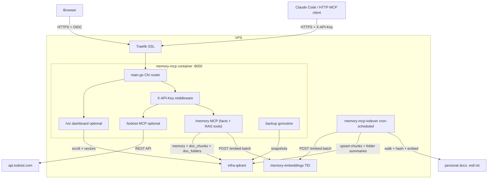
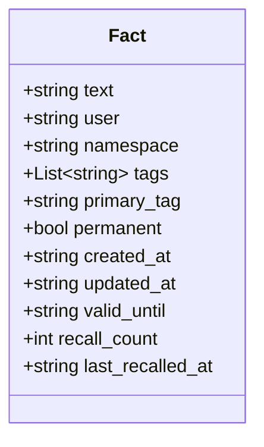

# Personal Memory Stack

Self-hosted semantic memory + Todoist + hierarchical document RAG for any MCP-compatible AI client. Stores and retrieves facts using vector embeddings, searches your personal markdown documents with a folder-first retrieval strategy, and exposes Todoist as a server-side MCP tool — no third-party cloud auth needed, all credentials stay on your VPS.

Written in Go as a single static binary (plus a standalone indexer binary for cron-based re-indexing).

## Stack

| Component | Role |
|---|---|
| [Qdrant](https://qdrant.tech/) | Vector database |
| [Text Embeddings Inference](https://github.com/huggingface/text-embeddings-inference) | Local embedding model server |
| [intfloat/multilingual-e5-small](https://huggingface.co/intfloat/multilingual-e5-small) | Embedding model (multilingual, ~470MB) |
| [mcp-go](https://github.com/mark3labs/mcp-go) | MCP server implementation |
| [Chi](https://github.com/go-chi/chi) | HTTP router |
| [vis.js](https://visjs.org/) | Interactive graph and timeline visualization |
| Traefik v3 | Reverse proxy, SSL, Authentik ForwardAuth (OIDC) for viz |

## Architecture

Two Docker services in this repo: `memory-embeddings` (TEI), `memory-mcp` (Go server). Qdrant is provided by the infra stack (`infra-qdrant`) and reached on the `infra` Docker network. TEI and Qdrant are internal — not exposed outside Docker networks.



### Auth

- **MCP endpoints** (`/memory`, `/todoist`) — protected by application-level auth. Existing clients can use `X-API-Key: <key>` or `Authorization: Bearer <API_KEY>`.
- **ChatGPT Apps / connectors** — optional OAuth/OIDC mode for authenticated MCP onboarding. When `OAUTH_ENABLED=true`, unauthenticated MCP requests return a `WWW-Authenticate` challenge that points to `/.well-known/oauth-protected-resource`, and OAuth bearer JWTs are validated by issuer, audience, expiration, and scope before tools run.
- **Health** (`/health`) — public liveness endpoint.
- **Viz dashboard** (`/viz`) — protected by Authentik ForwardAuth (OIDC) at Traefik layer, so browsers get a proper OIDC login flow

### Visualization (`mcp.<domain>/viz`)

- **Overview** — treemap of facts by namespace + `primary_tag`, plus an activity heatmap.
- **Duplicates** — near-duplicate pairs (cosine ≥ 0.90) for cleanup.
- **Forgotten** — facts with `recall_count = 0`.
- **Timeline** — facts plotted by creation date, grouped by namespace (vis-timeline).
- **Graph** — interactive force-directed network (vis-network). Nodes = facts, edges = cosine similarity above threshold.
- **Documents** *(shown only when `ENABLE_RAG=true`)* — collapsible folder tree of everything the RAG indexer has stored, with per-folder and per-file chunk counts and last-indexed timestamps.

## Data Model

Each stored fact is a Qdrant point with the following payload:



- **namespace** — logical group (`work`, `personal`, `projects`, …)
- **tags** — semantic labels used for filtering and retrieval
- **primary_tag** — one tag selected as the fact's primary overview group. It is either empty or also present in `tags`. If exactly one tag is supplied and `primary_tag` is omitted, the server uses that tag as `primary_tag`; with multiple tags, clients should set it explicitly.
- **permanent** — if `true`, never deleted by `forget_old()`
- **valid_until** — ISO date; expired facts are excluded from search results
- **recall_count** — incremented each time the fact is returned by `recall_facts`

Point IDs: new points use deterministic UUID-v5-like hex IDs (SHA1 of text). Legacy points created by the old Python implementation use integer IDs — the Go client handles both transparently.

## MCP Tools

### memory — Writing

| Tool | Description |
|---|---|
| `store_fact(fact, tags?, primary_tag?, namespace?, permanent?, valid_until?)` | Embed and save a fact. Skips near-duplicates (cosine ≥ 0.97). Warns about potentially contradicting facts (cosine 0.60–0.97). |
| `update_fact(old_query, new_fact, tags?, primary_tag?, namespace?, permanent?)` | Semantically find a fact and replace it. Preserves metadata unless overridden. |
| `delete_fact(query, namespace?)` | Semantically find and delete the closest matching fact. |
| `forget_old(days?, namespace?, dry_run?)` | Delete facts older than N days. Skips `permanent=true`. Default: `dry_run=true`. |
| `import_facts(facts)` | Bulk import from a JSON array (e.g. from `export_facts`). Deduplicates on import. |

### memory — Reading

| Tool | Description |
|---|---|
| `recall_facts(query, namespace?, limit?)` | Semantic search. Returns facts with scores. Filters expired facts. Increments `recall_count`. |
| `list_facts(namespace?)` | List all facts with metadata. |
| `find_related(query, namespace?, limit?)` | Find semantically related facts that are not direct duplicates (score 0.60–0.97). |
| `get_stats()` | Total counts, namespace breakdown, tag distribution, most recalled facts. |
| `list_tags(namespace?)` | All unique tags with usage counts. |
| `export_facts(namespace?)` | Export all facts as JSON for backup or migration. |

### todoist

| Tool | Description |
|---|---|
| `get_projects()` | List all Todoist projects with IDs. |
| `get_labels()` | List all personal labels with IDs. |
| `get_tasks(project_id?, filter?, limit?)` | List active tasks. `filter` uses Todoist filter syntax (e.g. `today`, `overdue`, `#Work`, `@label`). |
| `create_task(content, project_id?, due_string?, priority?, labels?)` | Create a task. Priority 1–4. |
| `complete_task(task_id)` | Mark a task as complete. |
| `update_task(task_id, content?, due_string?, priority?, labels?)` | Update an existing task. |
| `delete_task(task_id)` | Delete a task permanently. |

### rag (registered on `/memory` when `ENABLE_RAG=true`)

| Tool | Description |
|---|---|
| `search_documents(query, limit?, mode?)` | Semantic search over personal documents. Default `mode="hierarchical"`: finds top folders first, then searches chunks within them (with flat fallback if no folder scores above threshold). `mode="flat"` forces a plain vector search across all chunks. File paths are returned relative to `RAG_DOCUMENTS_DIR`. |
| `reindex_documents()` | Launches incremental re-indexing in the background. Returns immediately. Skips unchanged files (SHA256 hash); detects and rebuilds half-indexed files; mutex-guarded so only one run at a time. Stale-file cleanup is aborted if the walk was incomplete or would remove more than half the index. |

## Prerequisites (VPS)

- Docker + Docker Compose
- Traefik v3 with:
  - External network named `traefik`
  - `letsEncrypt` certresolver configured
  - `authentik-auth` ForwardAuth middleware configured (only needed if `ENABLE_VIZ=true`)

## Server Setup (VPS)

```bash
mkdir -p /root/memory
cp .env.example .env
nano .env
docker compose up -d
```

### `.env` variables

| Variable | Description |
|---|---|
| `MEMORY_DOMAIN` | Your domain, e.g. `example.com` — MCP available at `mcp.<domain>` |
| `API_KEY` | Shared secret for `X-API-Key` header on MCP endpoints. Generate with `openssl rand -hex 32`. |
| `EMBED_MODEL` | HuggingFace model ID, default `intfloat/multilingual-e5-small` |
| `MEMORY_USER` | Username stored as metadata on facts |
| `ENABLE_TODOIST` | Set to `true` to enable Todoist MCP server (default: `false`) |
| `ENABLE_VIZ` | Set to `true` to enable visualization dashboard (default: `false`) |
| `OAUTH_ENABLED` | Set to `true` to allow ChatGPT Apps / connector OAuth bearer tokens in addition to `API_KEY`. |
| `OAUTH_ISSUER` | OAuth/OIDC issuer URL, for example an Authentik provider URL. |
| `OAUTH_RESOURCE` | Canonical MCP resource URL, usually `https://mcp.<domain>`. Defaults from `MEMORY_DOMAIN` when omitted. |
| `OAUTH_AUDIENCE` | Expected JWT audience. Defaults to `OAUTH_RESOURCE`. |
| `OAUTH_SCOPES` | Comma-separated required OAuth scopes. First-pass ChatGPT setup uses `memory:mcp`. |
| `OAUTH_JWKS_URL` | Optional JWKS URL. If omitted, the server discovers `jwks_uri` from `OAUTH_ISSUER/.well-known/openid-configuration`. |
| `OAUTH_AUTHORIZATION_SERVERS` | Optional comma-separated authorization server URLs for protected-resource metadata. Defaults to `OAUTH_ISSUER`. |
| `OAUTH_RESOURCE_DOCUMENTATION` | Optional documentation URL returned in protected-resource metadata. |
| `TODOIST_TOKEN` | Todoist API token — get it at Settings → Integrations → Developer (only needed when `ENABLE_TODOIST=true`) |
| `KEEP_SNAPSHOTS` | Number of snapshots to retain (default: `7`) |
| `BACKUP_INTERVAL_HOURS` | How often the backup runs (default: `24`) |
| `VIZ_SIMILARITY_THRESHOLD` | Default similarity threshold for graph edges (default: `0.65`) |
| `DEDUP_THRESHOLD` | Cosine similarity above which a new fact is treated as a duplicate (default: `0.97`) |
| `CONTRADICTION_LOW` | Lower bound for contradiction warnings (default: `0.60`) |
| `CACHE_TTL` | In-memory cache TTL for `recall_facts`, in seconds (default: `60`) |
| `ENABLE_RAG` | Set to `true` to enable the document-RAG tools (`search_documents`, `reindex_documents`) on the `/memory` endpoint. Default: `false` |
| `RAG_DOCUMENTS_DIR` | Root directory to index. Hidden dirs (`.git`, `.sync`, …) are skipped. Default: `/root/documents/personal` |
| `RAG_CHUNK_MAX_BYTES` | Max chunk size (bytes). Markdown is split heading → paragraph → sentence → hard split. Default: `1500` |
| `RAG_FOLDER_TOP_K` | Number of top folders to consider in hierarchical search. Default: `3` |
| `RAG_FOLDER_THRESHOLD` | Min folder similarity score; below this we fall back to flat chunk search. Default: `0.50` |
| `RAG_COLLECTION_CHUNKS` | Qdrant collection name for chunks. Default: `doc_chunks` |
| `RAG_COLLECTION_FOLDERS` | Qdrant collection name for folder summaries. Default: `doc_folders` |
| `RAG_REINDEX_INTERVAL_MINUTES` | Auto-rescan cadence in minutes for the in-server goroutine. `0` disables it — trigger manually or via cron. Default: `0` |

Track TEI model download on first start:
```bash
docker logs -f memory-embeddings
# Ready when you see: Ready
```

Verify Qdrant (on VPS):
```bash
curl http://localhost:6333/healthz
# → {"title":"qdrant - Ready"}
```

## Backups

Backup runs as a goroutine inside `memory-mcp` — no separate service or cron needed.

- Creates a Qdrant snapshot every `BACKUP_INTERVAL_HOURS` hours (default: 24)
- Snapshots are stored at `/root/memory/qdrant_snapshots/` on the host
- Keeps the last `KEEP_SNAPSHOTS` snapshots (default: 7), deletes older ones

Backup logs appear in `docker logs memory-mcp`.

Snapshots are stored locally on the VPS only. Point rsync, rclone, or Resilio Sync at `/root/memory/qdrant_snapshots/` — snapshots are self-contained `.snapshot` files, safe to copy at any time.

To restore from a snapshot:
```bash
curl -X POST "http://localhost:6333/collections/memory/snapshots/recover" \
  -H "Content-Type: application/json" \
  -d '{"location": "file:///qdrant/snapshots/memory/<snapshot-name>.snapshot"}'
```

## Document RAG (optional)

When `ENABLE_RAG=true`, two extra MCP tools are registered on `/memory` and the `memory-mcp` image ships with a second binary (`/personal-memory-indexer`) for offline indexing.

### How it works

1. **Walk** `RAG_DOCUMENTS_DIR` for `.md` / `.markdown` / `.txt` files. Hidden directories (`.git`, `.sync`, `.trash`, …) are skipped.
2. **Chunk** each markdown file along headings (H1–H3), then paragraphs, then sentences, falling back to a rune-aware hard split when a sentence still exceeds `RAG_CHUNK_MAX_BYTES`.
3. **Embed** all chunks for a file in a batch, using the same TEI instance the memory layer uses (batch size 32 per HTTP call).
4. **Upsert** into the `doc_chunks` collection with payload `{text, file_path, folder_path, chunk_index, total_chunks, heading, file_hash, indexed_at}`.
5. **Summarize each folder** (no LLM — folder summary is just the filename list + each file's first H1/H2/H3 + a snippet from up to 5 files) and upsert into `doc_folders`.

Re-indexing is incremental — unchanged files are detected via SHA256 `file_hash` stored in Qdrant payload, and skipped. A single `ScrollAll` at the start of each run loads all existing hashes in one request, so even with thousands of files there's no per-file round-trip. Half-indexed files from prior partial failures (where `actualCount != total_chunks`) are detected and rebuilt on the next run.

### Querying

```bash
curl -X POST https://mcp.<domain>/memory \
  -H "Authorization: Bearer $API_KEY" \
  -H "Content-Type: application/json" \
  -d '{"method":"tools/call","params":{"name":"search_documents","arguments":{"query":"architecture decisions"}}}'
```

Response is a JSON array of matching chunks with `score`, `text`, `file_path` (relative to `RAG_DOCUMENTS_DIR`), `heading`, and `chunk_index`.

### Getting documents onto the VPS

The intended flow is Resilio Sync (or any file sync tool) from your laptop → `RAG_DOCUMENTS_DIR` on the VPS. The indexer is FS-agnostic; it only reads files and hashes content.

### Re-indexing

Three ways to trigger it:

**A. From an MCP client** — call `reindex_documents()`. Returns immediately; the indexer runs in a background goroutine on the server's lifetime context (cancelled cleanly on shutdown). A second call while one is in progress returns `"reindex already in progress"` — no queue, no duplication.

**B. Built-in auto-rescan (recommended)** — set `RAG_REINDEX_INTERVAL_MINUTES=30` (or any positive value) in the server env. A goroutine running alongside the HTTP server re-indexes the docs dir on that cadence, sharing the same mutex as the MCP tool so a scheduled run and a manual one can't collide. Zero (the default) keeps the server purely on-demand.

**C. Via the standalone binary on the VPS** — useful for host-level cron scheduling or one-shot first passes:

```bash
docker compose exec memory-mcp /personal-memory-indexer
```

A typical crontab entry:

```cron
*/30 * * * * docker compose -f /root/memory/docker-compose.yml exec -T memory-mcp /personal-memory-indexer
```

The binary respects the same `RAG_*` and `QDRANT_URL` / `EMBED_URL` env vars as the server and exits 0 on success.

### Safety

- If the directory walk errors on any path (transient permission issue, Resilio mid-sync, NFS glitch), stale-file cleanup for that run is skipped — the index is never wiped because of a read hiccup.
- If the number of walked files is less than half of what Qdrant currently has indexed, cleanup is also skipped and logged.
- Old chunks for a changed file are only deleted after all new chunks have been successfully embedded — an embedding failure leaves the previous version intact.

## Client Setup

Two separate MCP servers:

| Field | Memory | Todoist |
|---|---|---|
| Type | Streamable HTTP | Streamable HTTP |
| URL | `https://mcp.yourdomain.com/memory` | `https://mcp.yourdomain.com/todoist` |
| Auth header | `X-API-Key: <key>` or `Authorization: Bearer <key>` | same |

**Claude Code** — add both with one command each (add `--scope user` to make them available across all projects):
```bash
export API_KEY='<your API_KEY>'

claude mcp add --transport http personal-memory https://mcp.yourdomain.com/memory \
  --header "X-API-Key: $API_KEY" \
  --scope user

claude mcp add --transport http todoist https://mcp.yourdomain.com/todoist \
  --header "X-API-Key: $API_KEY" \
  --scope user
```

**Claude Desktop / Perplexity Desktop** — Claude Desktop and Perplexity Desktop don't support remote HTTP MCP servers directly. Use [mcp-remote](https://github.com/geelen/mcp-remote) as a local proxy. Add to `claude_desktop_config.json` (Claude: `~/Library/Application Support/Claude/claude_desktop_config.json`):

```json
{
  "mcpServers": {
    "personal-memory": {
      "command": "npx",
      "args": [
        "mcp-remote",
        "https://mcp.yourdomain.com/memory",
        "--header",
        "Authorization:Bearer ${MEMORY_API_KEY}"
      ],
      "env": {
        "MEMORY_API_KEY": "<your API_KEY>"
      }
    }
  }
}
```

A ready-to-edit example is also available in [`claude_desktop_config.example.json`](./claude_desktop_config.example.json).

**Web-based clients (Perplexity web, etc.)** — use Streamable HTTP transport with `Authorization: Bearer <API_KEY>` header directly (no proxy needed).

**ChatGPT Apps / connectors** — use the `/memory` MCP URL as the server URL:
```text
https://mcp.yourdomain.com/memory
```

For authenticated onboarding, configure a dedicated OAuth/OIDC application in Authentik and enable OAuth in `memory-mcp`. The server exposes protected resource metadata at:
```text
https://mcp.yourdomain.com/.well-known/oauth-protected-resource
```

First-pass recommended scope is `memory:mcp`, memory/RAG only, personal single-user use. Copy the ChatGPT callback URL shown in the app management page into Authentik's allowed redirect URIs.

## Building

```bash
go build ./cmd/server ./cmd/indexer
go test ./...
```

Or via Docker (multi-stage build, both binaries in the final image):
```bash
docker build -t personal-memory .
```

The resulting image ships `/personal-memory` (the MCP server, set as ENTRYPOINT) and `/personal-memory-indexer` (standalone RAG indexer for cron / one-shot use).

### Image tags (GHCR)

`.github/workflows/docker.yml` runs `go vet` + `go test`, builds, and pushes to `ghcr.io/dzarlax-ai/personal-memory` on every push to `main` or any `feature/**` branch.

| Tag | Source | Use case |
|---|---|---|
| `latest` | `main` only | Stable production deploy |
| `main` | `main` | Pinned alias for `latest` |
| `beta` | any `feature/**` push (moves) | Testing the newest feature-branch build |
| `feature-<name>` | the matching branch | Pinning to a specific feature (e.g. `feature-rag`) |
| `sha-<short>` | every push | Reproducible pin by commit |

To test a feature branch before merging: point your deploy's `image:` at `:beta` or `:feature-<name>`, run, verify, then merge to `main` and switch back to `:latest`.

## Project Layout

```
cmd/
  server/            entrypoint for the MCP server
  indexer/           standalone RAG indexer binary (cron-friendly)
internal/
  config/            env vars → struct
  middleware/        X-API-Key + Bearer auth
  qdrant/            Qdrant REST client (upsert, search, scroll, delete, snapshots, field index)
  embeddings/        TEI REST client (Embed + EmbedBatch)
  memory/            memory MCP server (11 tools) + in-memory cache
  todoist/           todoist MCP server (7 tools) + REST client
  rag/               document RAG (chunker, folder summariser, indexer, MCP tools)
  viz/               viz dashboard handler + cosine similarity + embedded index.html
  backup/            Qdrant snapshot loop
```

## Best Practices

To get the most out of persistent memory, instruct your AI client to use it proactively. For Claude Code, add the following to your global CLAUDE.md:

| OS | Path |
|---|---|
| macOS / Linux | `~/.claude/CLAUDE.md` |
| Windows | `%USERPROFILE%\.claude\CLAUDE.md` |

````markdown
## Personal Memory (MCP: personal-memory)

The `personal-memory` MCP server is always available. Use it proactively — don't wait to be asked. Two distinct knowledge stores live behind it:

- **`recall_facts` / `store_fact`** — short, explicit facts you deliberately saved (preferences, decisions, profile, project stack choices). Use these for things the user told you or you agreed on.
- **`search_documents`** — semantic search over the user's personal markdown library (articles, notes, course materials, playbooks, meeting notes). Use this when the user asks "how to…", "what do I know about…", or references an article/note they think they have.

### When to recall facts
- At the start of any session involving a known project — run `recall_facts` to load context
- Before making architectural decisions — check if relevant preferences or past decisions are stored
- When the user references established context ("as usual", "like before", "you know I prefer…")

### When to search documents
- The user asks a broad knowledge question likely covered by their saved articles/notes
- The user says "I saved something on…", "there was that piece about…"
- Before giving a generic answer on a topic they may have curated content about

Default mode is `hierarchical` (folders first, then chunks). Switch to `mode="flat"` for very specific queries that span topics across folders. File paths returned are relative to the docs root (e.g. `PM enforcement/Articles/…`).

`reindex_documents` — almost never needed manually. The server auto-rescans every 30 minutes; call it only when the user says "I just added docs, pick them up now".

### When to store
- User states a preference or decision that should persist ("always use X", "never do Y")
- A non-obvious fact about a project is established (tech stack, naming convention, key dependency)
- Something important was learned that would be useful in future sessions

When calling `store_fact`, include:
- `namespace` — broad context bucket
- `tags` — semantic labels for retrieval
- `primary_tag` — the single main topic for visualization and routing

Do NOT `store_fact` for content that lives in the user's markdown docs — that's already indexed and searchable via `search_documents`.

### Namespace convention
Always specify a namespace. Never store everything in `default`. Keep namespaces broad and portable; do not create a namespace for every project or topic.

| Context | Namespace |
|---|---|
| Personal preferences, habits | `personal` |
| Personal projects | `projects` |
| Cross-project technical preferences | `tech` |
| Work / professional context | `work` |
| Job search, CVs, interviews | `job-search` |

### Permanent facts
Use `permanent=True` for facts that should never expire:
fundamental preferences, identity facts, long-term architectural decisions.

### Tags
Use tags for both topic labels and semantic labels. Prefer stable, lowercase kebab-case tags.

Examples:
- Topic tags: `personal-memory`, `health`, `finance`, `design-system`
- Semantic tags: `decision`, `preference`, `constraint`, `architecture`, `deployment`

### Primary tags
Always set `primary_tag` when storing a fact with multiple tags. It controls high-level grouping in the visualization and must name the main topic a future model should use to route the fact. Keep `primary_tag` as one of the regular `tags`; if you pass only `primary_tag`, the server will also add it to `tags`.

Good:
`store_fact(fact="...", namespace="projects", tags=["personal-memory", "architecture", "decision"], primary_tag="personal-memory")`

Avoid:
`store_fact(fact="...", namespace="personal-memory", tags=["architecture", "decision"])`
````
